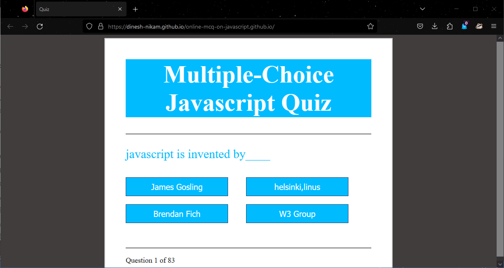

# online-mcq-on-javascript.github.io


# Online JavaScript MCQ (Multiple Choice Questions) 📝

This project is an online JavaScript MCQ (Multiple Choice Questions) web application designed to test your JavaScript knowledge. The application offers a set of questions covering various topics in JavaScript, providing an interactive quiz experience.

## Features 🚀

- **Multiple Choice Questions:** Engage in a series of JavaScript multiple-choice questions to test your understanding.
- **Randomized Questions:** The questions are randomized to ensure a different order for each attempt.
- **Real-time Feedback:** Receive instant feedback on your answers, showing correct answers after each submission.
- **Score Tracking:** Track your scores as you progress through the quiz and aim for the highest score.
- **Responsive Design:** Enjoy a seamless experience on any device, whether it's a desktop, tablet, or smartphone.

## Demo 🎥



You can check out the live demo of the application at : https://dinesh-nikam.github.io/online-mcq-on-javascript.github.io/

## Getting Started 🛠️

Follow these steps to set up the project on your local machine:

1. **Clone the Repository:**
   ```bash
  gh repo clone dinesh-nikam/online-mcq-on-javascript.github.io
   cd online-mcq-on-javascript
   ```

2. **Open `index.html` in your web browser:** No server setup is required as the application runs entirely in the browser.

## How to Use 📚

1. Select the answer by clicking on the corresponding option for each question.
2. After answering all the questions, click the "Submit" button to view your results.
3. The application will display the total score and indicate which answers are correct and incorrect.
4. You can retake the quiz or exit the application after viewing the results.

## Contribution Guidelines 🤝❤️

Contributions are welcome! If you wish to add more questions or improve the application, feel free to submit a pull request. Make sure to follow the established coding style and guidelines.

## Technologies Used 🛠️

- HTML, CSS, JavaScript

## License 📄

This project is licensed under the [MIT License](LICENSE).

## Acknowledgments 🙏


---

